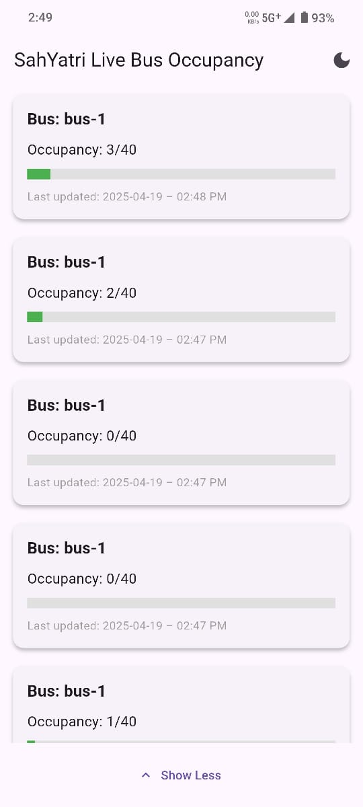
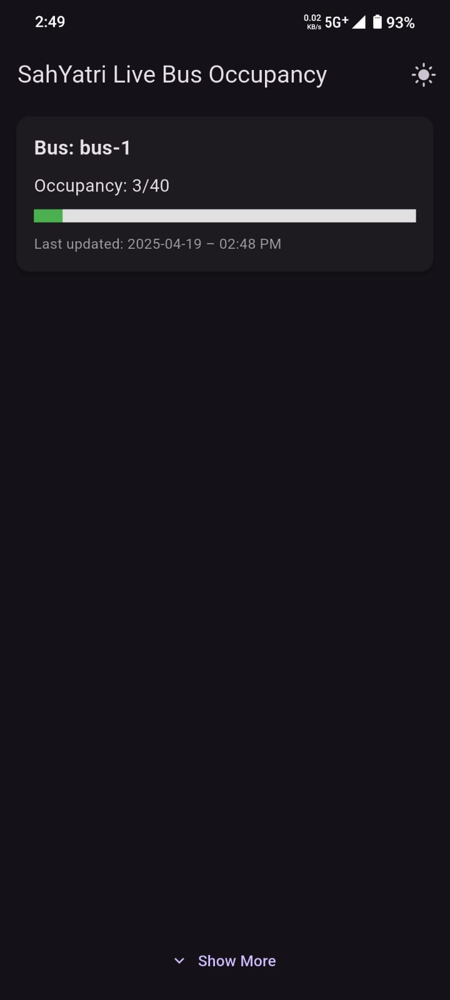
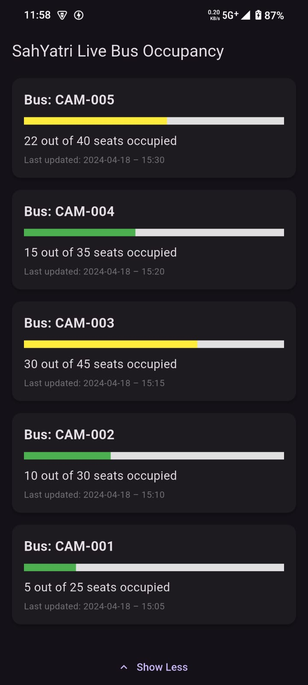

# 🚌 SahYatri - Live Bus Occupancy App

**SahYatri** is a real-time Flutter application that displays **live bus occupancy** data. It helps commuters plan their rides by visualizing how full each bus is, using an intuitive bar-based UI, color codes, and timestamped updates.

---

## 📱 Features

- 🔄 **Live Data Fetching**: Retrieves bus occupancy data from an API.
- 🔔 **Full Bus Notifications**: Alerts users when a bus exceeds its capacity.
- 🌗 **Dark/Light Mode**: Toggle between light and dark themes.
- 📊 **Occupancy Color Coding**:
  - Green: Less than 50%
  - Orange: 50–90%
  - Red: More than 90%
- 🔽 **Show More / Show Less**: Expands to show more bus entries.
- ⚙️ **Offline Fallback**: Displays static demo data if API fails.
- 🔁 **Auto-Refresh**: Automatically updates data every 5 seconds.
- 🎬 **Animated UI**: Smooth expansion and collapses.
- 🌐 **Formatted Timestamps**: Easily readable time display.

---

## 📱 Screenshots

<p align="center">
  
  
  
</p>

---

## 🧱 Tech Stack

- **Flutter** (Dart)
- **REST API Integration**
- **Shared Preferences**
- **Material Design**

---

## 🚀 Getting Started

### Prerequisites

- Flutter SDK (version ≥ 3.0)
- Dart SDK
- Android Studio or VS Code
- Device/Emulator to run app

### Installation

```bash
git clone https://github.com/AmanVerma1067/sahyatri_apk.git
cd sahyatri
flutter pub get
flutter run
